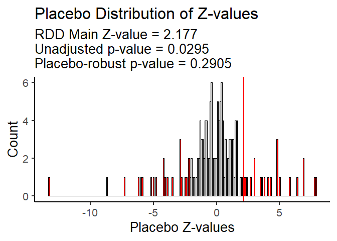

<!-- README.md is generated from README.Rmd. Please edit that file -->

# uesdRobust

<!-- badges: start -->
<!-- badges: end -->

The uesdRobust R package accompanies the paper “Type I Error Inflation
in Unexpected Event during Survey Designs” by Joris Frese and Sascha
Riaz. In this paper, we empirically demonstrate a substantially inflated
rate of false-positive findings in UESD research and propose ways to
adjust UESD test statistics accordingly.

The goal of the uesdRobust R package is to assist users in analyzing
(OLS or RDD) UESDs. The package also allows users to estimate
placebo-robust p-values and confidence intervals that adjust UESD
results to context-specific Type I error inflation. For these purposes,
the package offers three complementary functions: **uesd_robust_ols**
for (placebo-)robust UESDs with the OLS estimator, **uesd_robust_rdd**
for (placebo-)robust UESDs with the RDD estimator, and
**uesd_placebo_plot** to visualize the empirical distribution of placebo
T or Z statistics and the share of placebo tests with more extreme
statistics than the main test.

## Installation

You can install the **uesdRobust** R package like so:

``` r
devtools::install_github("fresej/uesdRobust")
```

## uesd_robust_ols

The **uesd_robust_ols** function is used to analyze UESDs with the OLS
estimator. It has 2 basic purposes: **1)** The function wraps features
from stats, sandwich, and lmtest to estimate basic dummy-OLS UESDs with
heteroskedasticity-robust or cluster-robust standard errors, requiring
only a data frame, an outcome variable, and a numeric running variable
(i.e., a date variable turned into a numeric indicator) as inputs. We
hope that this wrapper makes UESD estimation more accessible for
researchers new to this method. **2)** The function additionally allows
for the estimation of placebo tests with cutoffs across the whole range
of the running variable. Based on these estimations, it creates an
empirical distribution of T-statistics that is used to create a
placebo-robust p-value and 95% confidence interval.

The function contains the following parameters:

**df**: A data.frame containing your data (mandatory).

**outcome**: String name of the numeric outcome variable (mandatory).

**date_num**: String name of the numeric running date variable
(mandatory).

**bw**: Numeric half‐width of the window around `cutoff`. Defaults to
15.

**cutoff**: Numeric cutoff on `date_num` defining the treated (≥cutoff)
vs control (\<cutoff) groups. Defaults to 0.

**cluster**: NULL (default) for heteroskedasticity‐robust SE, or a
string naming a column in `df` on which to cluster.

**placebos**: Logical; if TRUE, runs regressions at every feasible
cutoff (skipping `excluded` after the main), and computes a
placebo‐robust p‐value and CI.

**excluded**: Integer; number of subsequent cutoffs after the main one
to skip in the placebo loop (default = 3).

## uesd_robust_rdd

The **uesd_robust_rdd** function is used to analyze UESDs with the RDD
estimator. It has 2 basic purposes: **1)** The function wraps features
from stats and rdrobust to estimate basic RDD UESDs with
heteroskedasticity-robust and bias-corrected standard errors, requiring
only a data frame, an outcome variable, and a numeric running variable
(i.e., a date variable turned into a numeric indicator) as inputs. We
hope that this wrapper makes UESD estimation more accessible for
researchers new to this method. **2)** The function additionally allows
for the estimation of placebo tests with cutoffs across the whole range
of the running variable. Based on these estimations, it creates an
empirical distribution of Z-statistics that is used to create a
placebo-robust p-value and 95% confidence interval.

The function contains the following parameters:

**df**: A data.frame containing your data (mandatory).

**outcome**: String name of the numeric outcome variable (mandatory).

**running**: String name of the numeric running (forcing) variable
(mandatory).

**cutoff**: Numeric discontinuity point on `running`. Defaults to 0.

**bw**: Numeric half-width of the RDD window (h). If NULL (default),
uses rdrobust’s optimal bandwidth.

**placebos**: Logical; if TRUE, runs placebo RDDs at every feasible
cutoff (skipping `excluded` after the main) and computes a
placebo-robust p-value and CI.

**excluded**: Integer; number of subsequent cutoffs after the main one
to skip in the placebo loop (default = 3).

**se_type**: Character; which rdrobust row to use for placebo inference.
One of “conventional” (row 1), “bias-corrected” (row 2), or “robust”
(row 3). Default: “conventional”.

## uesd_placebo_plot

The **uesd_placebo_plot** function is used to visualize the empirical
distribution of UESD placebo test statistics and the relative position
of the original UESD test statistic. It takes the list objects created
by **uesd_robust_ols** or **uesd_robust_rdd** as inputs and wraps
features from ggplot2 to visualize them.

The function contains the following parameters:

**res**: A list returned (invisibly) by
`uesd_robust_ols(..., placebos = TRUE)` or
`uesd_robust_rdd(..., placebos = TRUE)`. It contains the results of all
placebo tests and the main test.

**binwidth**: Numeric. Width of the histogram bins (default = 0.1).

## Example

This is a basic example using simulated data to demonstrate one
hypothetical use case for the **uesdRobust** package.

``` r
library(uesdRobust)


# simulate some survey data with placebo effects
set.seed(123)
n <- 3000
df_sim <- data.frame(
  running = sample(-150:100, size = n, replace = TRUE)
)
main_cut    <- 0
main_eff    <- 1
placebo_cuts <- c(-76, -66, -56, -39, -30, -25, - 20, -17, -14, -11, -10, 
                  -7, -2,  10, 15, 18, 23, 27, 29,  30, 33, 31, 34,45,66,76)
placebo_eff  <- c( 1.5, -2, 1.9, 1.6, -0.3, 1.7, -0.4,  0.5, -2.3, 0.7, -0.4,  0.5, 
                   -0.3, 0.7, -0.4, 0.7, 0.9, 1.8, 3, 2.1, 2.2, 1.7, 1.1, 1.2, 1, -1)
df_sim$outcome <- 0
df_sim$outcome <- df_sim$outcome +
  main_eff * (df_sim$running >= main_cut)
for(i in seq_along(placebo_cuts)) {
  df_sim$outcome <- df_sim$outcome +
    placebo_eff[i] * (df_sim$running >= placebo_cuts[i])
}
df_sim$outcome <- df_sim$outcome +
  rnorm(n, mean = 0, sd = 1)


# RDD‐based UESD with the uesd_robust_rdd function:
rdd_res <- uesd_robust_rdd(
  df       = df_sim,
  outcome  = "outcome",
  running  = "running",
  cutoff   = 0,
  bw       = NULL,               
  placebos = TRUE,
  se_type  = "conventional"
)
#> Warning in rdrobust::rdrobust(y = df_clean[[outcome]], x = df_clean[[running]],
#> : Mass points detected in the running variable.
#> 
#>  RDD UESD for outcome: outcome 
#> Sharp RD estimates using local polynomial regression.
#> 
#> Number of Obs.                 3000
#> BW type                       mserd
#> Kernel                   Triangular
#> VCE method                       NN
#> 
#> Number of Obs.                 1779         1221
#> Eff. Number of Obs.              62           90
#> Order est. (p)                    1            1
#> Order bias  (q)                   2            2
#> BW est. (h)                   6.453        6.453
#> BW bias (b)                  11.592       11.592
#> rho (h/b)                     0.557        0.557
#> Unique Obs.                     150          101
#> 
#> =============================================================================
#>         Method     Coef. Std. Err.         z     P>|z|      [ 95% C.I. ]       
#> =============================================================================
#>   Conventional     0.866     0.410     2.113     0.035     [0.063 , 1.669]     
#>         Robust         -         -     2.115     0.034     [0.076 , 1.983]     
#> =============================================================================
#> 
#> Using [conventional] row for placebos:   estimate=0.8656   se=0.4096   z=2.1132   p=0.0346
#> 
#> Unadjusted 95% CI for ITT: [0.0628, 1.6685]
#> 
#> Placebo‐robust 95% CI for ITT: [-1.1163, 2.8475]
#> 
#> Unadjusted p-value for ITT: 0.03458
#> Placebo‐robust p-value for ITT: 0.19184


# plot of the placebo distribution of z‐values with the uesd_placebo_plot function:
uesd_placebo_plot(rdd_res)
```


